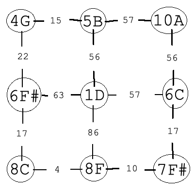
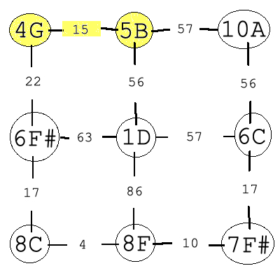
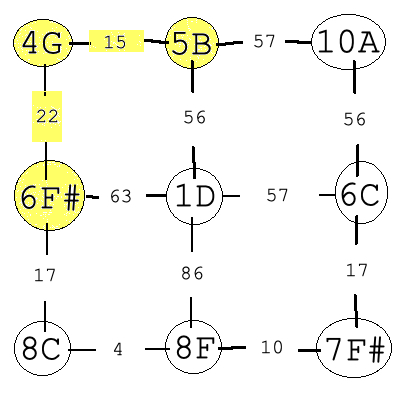
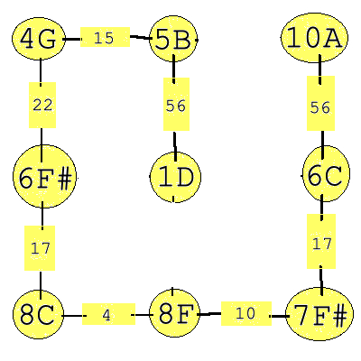
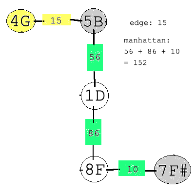
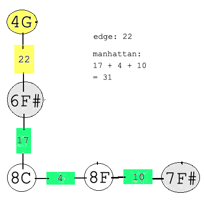
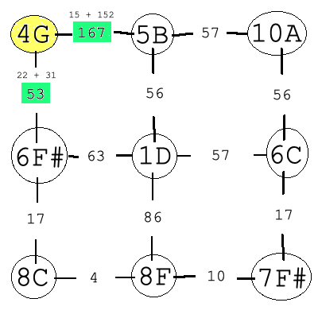
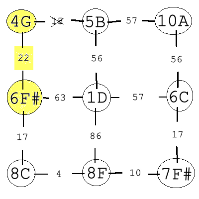
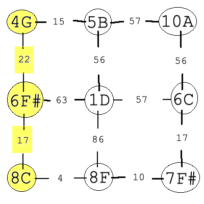
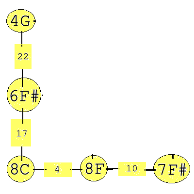

# Project Report

**by Leon Wang**

This report will visually demonstrate how the `Prim` and `AStar` files in this project are executed upon a `NoteGraph` object (which, at its core, is just a weighted graph) and then briefly discuss the findings of the project. For this demo, the `3x3.png` image will be used to load the NoteGraph. You can find this image in `images/basic` and it looks like this:

This is what the weighted graph would look like visually if you load this image into a NoteGraph object.

The nodes are `Note` objects and the edge weights are the interval distances between two Notes. More information can be found in `team_proposal.md` and in header file documentation.

### Prim's Algorithm

We'll run **Prim's Algorithm** first. It's a greedy algorithm and will produce a minimum spanning tree that visits every node in the graph using the lowest cost path (lowest Note interval).

Generally speaking, you can pick any random node to start Prim's on, but our version starts at the top-leftmost node, which is **4G** (the note G on the fourth octave). 

First, we mark the node as visited. Next, check the all edges of the current node AND any nodes that have been visited (which currently is just **4G**) that point to an unvisited node. Pick the edge that has the lowest weight. Right now, that would be **15**, the edge from **4G** to **5B**. Add the edge and new node, **5B**, to the minimum spanning tree (which is represented as a NoteGraph in our case) and step into the new node.

We repeat this process again. Mark **5B** as visited. Check all edges of the current node and any visited nodes that point to an unvisited node. We check all edges of **4G** and **5B**. Pick the lowest weight, **22**, and add the edge and new node, **6F#**, to the MST.

Do this process until all nodes are in the MST. Below is the completed MST.

To ensure that Prim's works on our NoteGraphs, we compared if the MST produced by our `prim` function matched the expected MST for a variety of NoteGraphs.

### A* Search

Now we'll run <b>A* Search</b> on the same graph. It's a path search algorithm that finds the shortest (lowest cost) path to a specified destination. Unlike Prim's Algorithm, it's not greedy, and uses a *heuristic* to inform itself of the next best step. 

Our NoteGraphs are guaranteed to be in grid format, which means every node has a maximum of four edges, or four directions. Because of this, our heuristic we use to pick the best edge is based on the *sum of the edge weight and the **Manhattan distance** between the node that the edge connects to, to the destination node*.

In `AStar.cpp`, the variable `F` is this heuristic calculation, and variables `g` and `h` are the edge weight and Manhattan distance calculation respectively. Basically, `F` = `g` + `h`.

So, every time we step into the next node, we look at all of its edges pointing to an unvisited node and calculate this said heuristic, and pick the lowest value that is calculated.

In our project, we use A* to find the shortest path starting from the top-leftmost node to the bottom-rightmost node, which for this image is from **4G** to **7F#**. 

Begin at **4G**, mark it as visited, and calculate our heuristic on adjacent nodes **5B** and **6F#**.

For **5B**, add the edge **15** and the Manhattan distance from **5B** to **7F#**, which is **152**.

For **6F#**, add the edge **22** and the Manhattan distance from **6F#** to **7F#**, which is **31**.

Now, we have our calculated heuristic cost for stepping into each adjacent node.

We step into **6F#** because (22 + 31) > (15 + 152), and repeat the steps above on that node.

We won't visualize the entirety of the next step on **6F#**, but calculated right it should look like this.

Finally, this is the MST produced after the algorithm completes.

To ensure that A* works on our NoteGraphs, we compared if the MST produced by our `aStar` function matched the expected MST for a variety of NoteGraphs, and because `aStar` internally calls `manh`, our Manhattan distance function, also tested whether that function worked.

### Project Findings
// todo
